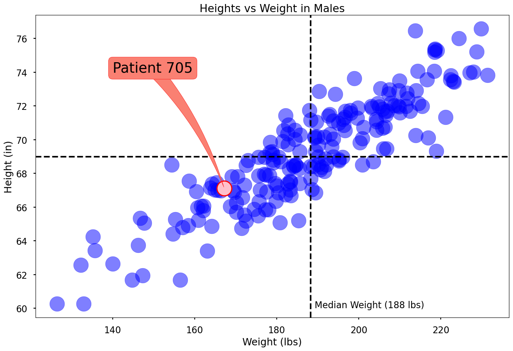

```python
import matplotlib.pyplot as plt
import pandas as pd

body_data = pd.read_csv("weights_and_heights.csv")
male = body_data[body_data["Gender"] == "Male"]
female = body_data[body_data["Gender"] == "Female"]

male_sample = male.sample(200, random_state = 42)
male_sample.describe()
patient = male_sample.loc[[705]]

median_weight = male_sample["Weight"].median()
median_height = male_sample["Height"].median()
min_weight = male_sample["Weight"].min()
min_height = male_sample["Height"].min()

plt.style.use("seaborn-v0_8-poster")
plt.scatter(male_sample["Weight"], male_sample["Height"], color = "blue", s = 700, alpha = 0.5)
plt.scatter(patient["Weight"], patient["Height"], color = "pink", s = 700, alpha = 1.0, edgecolor = "red", linewidth = 2)
plt.title("Heights vs Weight in Males")
plt.xlabel("Weight (lbs)")
plt.ylabel("Height (in)")
plt.axvline(x = median_weight, color = "black", linestyle = "--")
plt.axhline(y = median_height, color = "black", linestyle = "--")

## Annotation Step
plt.annotate(text = f"Median Weight ({round(median_weight)} lbs)",
             xy = (median_weight, min_height),
             xytext = (10,-10),
             textcoords = "offset pixels",
             fontsize = 16)
plt.annotate(text = f"Median Height ({round(median_height)} in)",
             xy = (median_height, min_weight),
             xytext = (-10,10),
             textcoords = "offset pixels",
             fontsize = 16)
plt.annotate(text = "Patient 705",
             xy = (patient["Weight"], patient["Height"]),
             xytext = (140,74),
             fontsize = 25,
             bbox = dict(boxstyle = "round",
                         fc = "salmon",
                         ec = "red"),
             arrowprops = dict(arrowstyle = "wedge,tail_width = 1.",
                               fc = "salmon",
                               ec = "red",
                               patchA = None,
                               connectionstyle = "arc3,rad = -0.1"))
                        
plt.tight_layout()
plt.savefig(fname = "exported_plot.png")
plt.show()

```

    /opt/anaconda3/lib/python3.13/site-packages/matplotlib/text.py:1475: FutureWarning: Calling float on a single element Series is deprecated and will raise a TypeError in the future. Use float(ser.iloc[0]) instead
      x = float(self.convert_xunits(x))
    /opt/anaconda3/lib/python3.13/site-packages/matplotlib/text.py:1477: FutureWarning: Calling float on a single element Series is deprecated and will raise a TypeError in the future. Use float(ser.iloc[0]) instead
      y = float(self.convert_yunits(y))


    

    


```python

```
